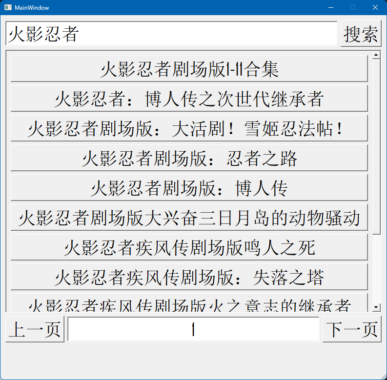

# 动漫下载器
这是一个带有ui的爬虫项目

## 功能特性

- 🔍 **搜索功能**：快速搜索你喜欢的动漫系列。
- 🚀 **批量下载**：一次性下载多个剧集或整季内容。
- 📦 **跨平台支持**：仅支持 Windows

## 安装

要安装动漫下载器，你需要在系统上安装 Python 3.9+ 和 `pip`。请按照以下步骤操作：

1. **克隆仓库**：
    ```bash
    git clone https://github.com/zht-git-0/dm_downloader
    cd dm_downloader
    ```

2. **安装依赖**：
    ```bash
    venv.bat
    ```
3. **运行程序**：
    ```bash
    start.bat
    ```
点击按钮开始下载

